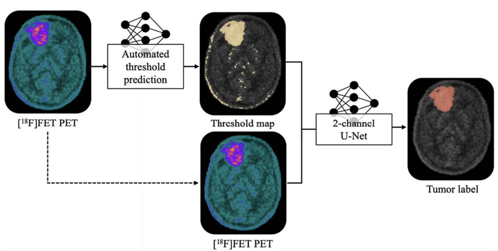

# PET-based glioblastoma segmentation

This repository contains the code used for the segmentation models discussed in the paper:

#### [Interobserver ground-truth variability limits performance of automated glioblastoma segmentation on [18F]FET PET](https://doi.org/10.1186/s40658-025-00767-y)

[18F]FET PET is used to assess glioblastoma extent by visualizing increased amino-acid uptake. Tumor delineation commonly relies on a foreground threshold derived from a background volume of interest (VOI) in normal-appearing brain tissue. This threshold defines the metabolic tumor volume (MTV), but both the background VOI and the resulting tumor segmentation can vary between readers.

This repository contains the code and trained models used to study whether such threshold information can guide automated glioblastoma segmentation. Besides a PET-only U-Net, the study evaluates a two-channel model that uses both the PET image and a threshold map, i.e. a binary map of voxels above the selected threshold. Additional models are provided to generate this threshold information automatically by predicting the background VOI, the threshold value, or the threshold map directly.

<!--  -->

## Training scripts

This repository is provided for reproducibility and is not actively maintained.

The training scripts for the different models described in the paper are named `Training_XXX.py`. 

The following models are available:
- 1C-UNet: a U-Net for tumor segmentation using 1 channel, the [18F]FET PET image
- 2C-UNet: a U-Net for tumor segmentation using 2 channels: the [18F]FET PET image and the threshold map
- DenseNetTH: a regression network with a DenseNet121 architecture to estimate the threshold value
- UNetBKG: a U-Net for segmentation of the background VOI
- UNetMulti: a U-Net for multi-label segmentation of the tumor, the crescent-shaped background and the whole brain
- UNetTM: a U-Net for segmentation of the threshold map

## Trained models

The trained models used in the study can be downloaded [here](https://drive.google.com/drive/folders/1D029CzFOn72ywTO4rZFwyVuYsAi9vhjI?usp=drive_link).  

## Citation

If you use this repository, please cite:

*De Sutter, S., Dirks, I., Raes, L. et al. Interobserver ground-truth variability limits performance of automated glioblastoma segmentation on [18F]FET PET. EJNMMI Phys 12, 54 (2025). https://doi.org/10.1186/s40658-025-00767-y*
